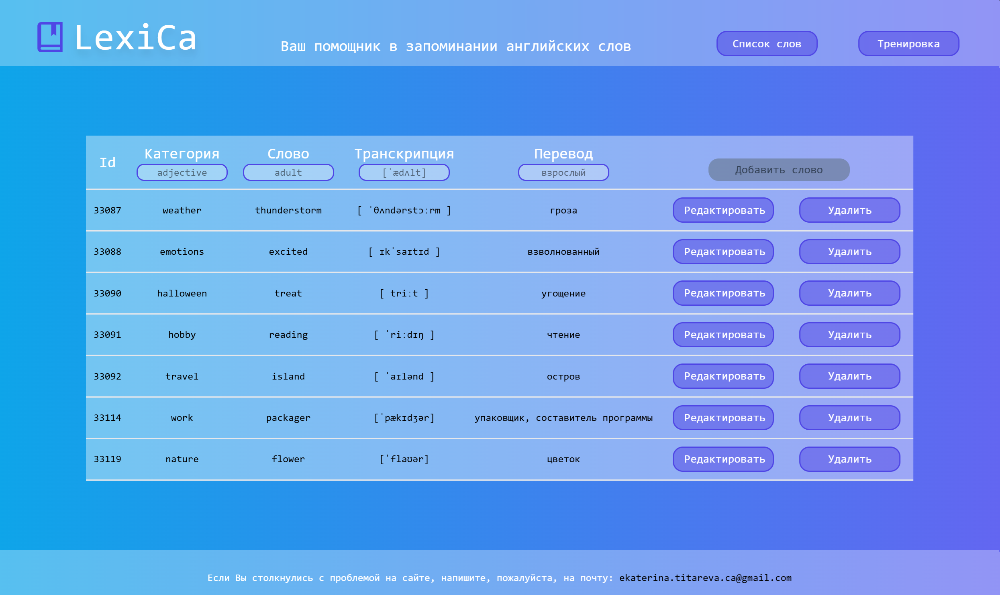
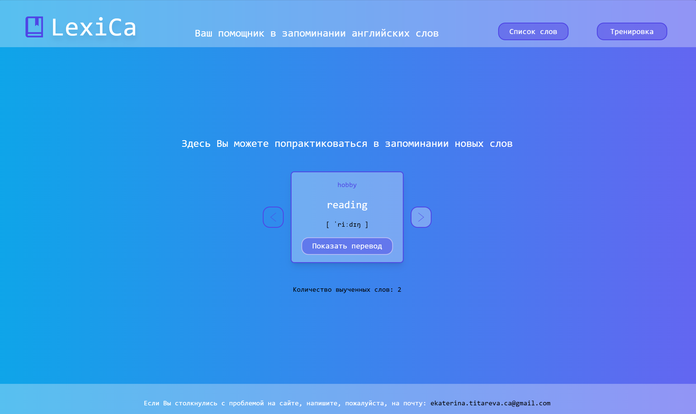
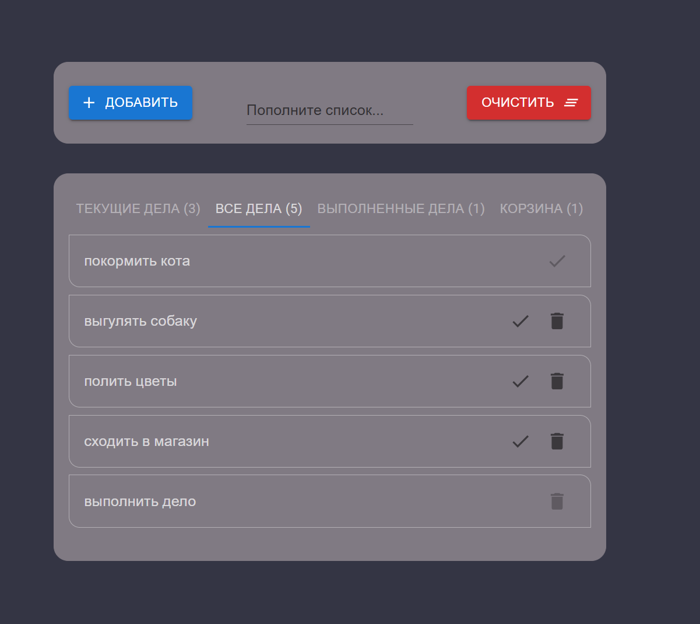
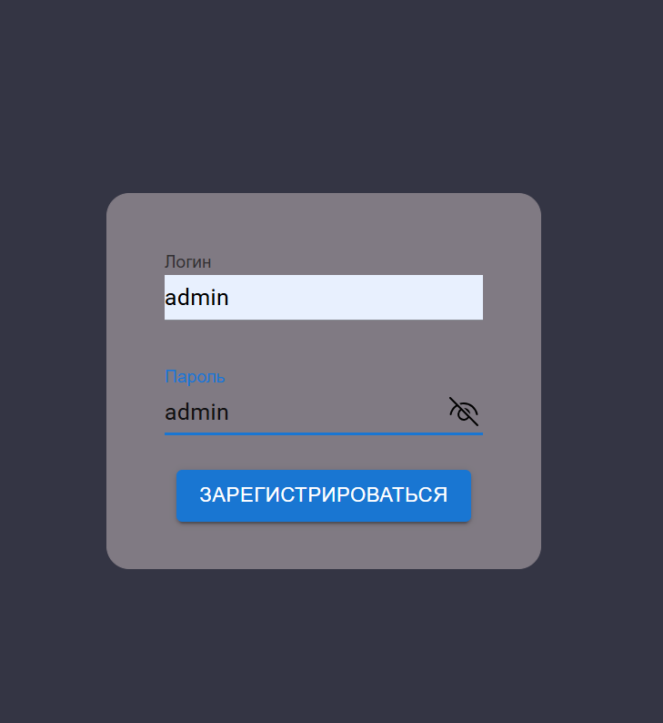

### Не теряйте, я сейчас на [GitLab](http://gitlab.revampit.ru/ekaterina.titareva)

### Стэк:

---

### Мои проекты:

#### 🔠 [Сайт для изучения английских слов (JS, React, MobX, API, Tailwind CSS, Create-react-app)](https://github.com/Ekaterina-Titareva/LexiCa)

## 

## 

#### 📝 [Сайт для составления списка дел с регистрацией (TS, React, Redux, CSS, MUI, LocalStorage, Cookie, Vite)](https://github.com/Ekaterina-Titareva/to-do_list)

|  |  |
| :-----------------------------: | :---------------------------------------: |

#### 💃🏻 [Сайт для магазина женской одежды (JS, React, Vite)](https://amili-shop.ru/)

## 

#### 🚀 [Вёрстка pixel-perfect страницы сайта с формой и анимацией (JS, CSS)](https://github.com/Ekaterina-Titareva/payment-service)

## 

---

<!--

 -->

   

